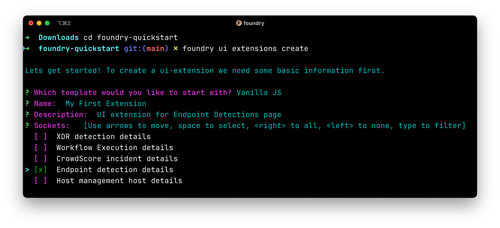
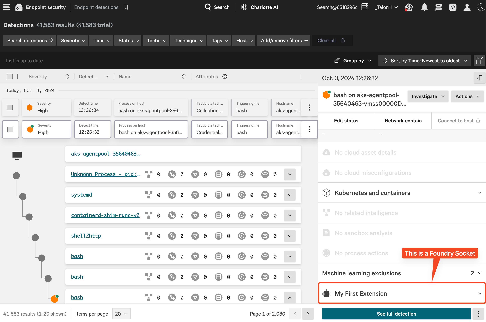
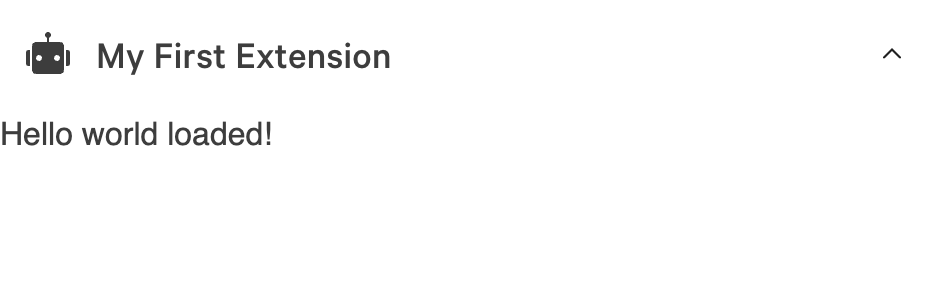
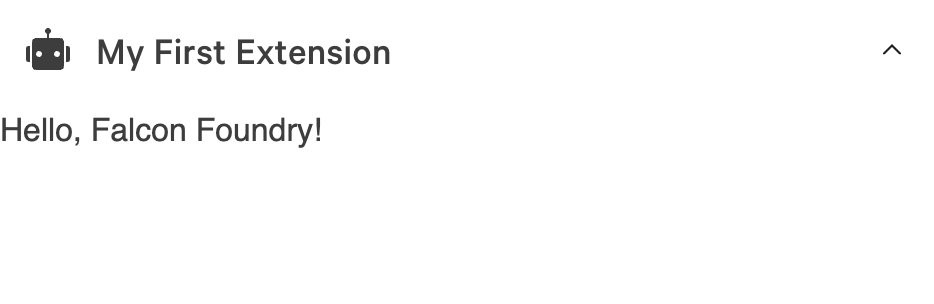
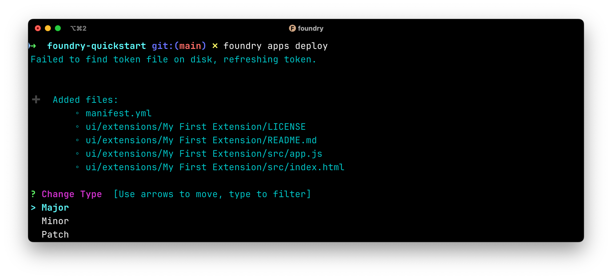
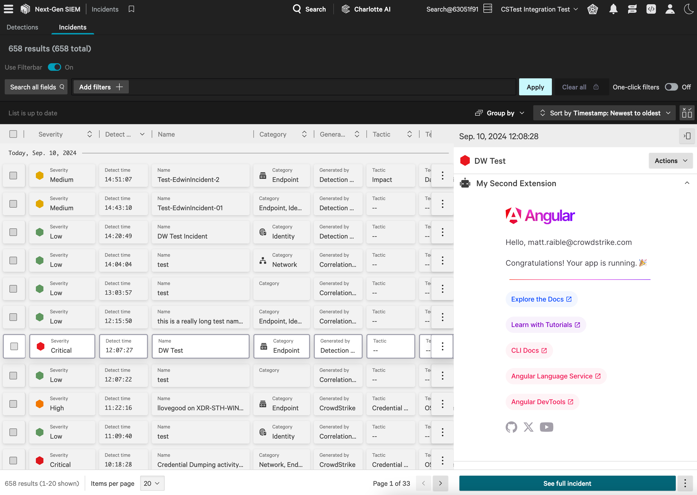

# A Practical Guide to Building a Falcon Foundry App for the First Time

Are you a cybersecurity professional who's experienced problems integrating security-related data streams from your systems? If you're using distributed systems and trying to analyze them during an incident, it can be painful. Alert fatigue is real. What if you could enhance the details of your threat detections to include data and response actions from third parties or your own custom apps to implement your own security process on the Falcon Platform? You can do that now with Falcon Foundry.

CrowdStrike is on the front lines of the fight against cybercriminals. We call them *adversaries*. You can learn about the names we've given them and where they live via our [Adversary Universe](https://www.crowdstrike.com/adversaries/). We even have an [Adversary Universe podcast](https://www.crowdstrike.com/resources/adversary-universe-podcast/), which provides you with insights about their motivations and the most recent research findings for you to stay on top of your game.

The Falcon platform has numerous modules with analytic and response features to defend against and hunt adversaries and now you can extend the power of the platform to your specific needs with Falcon Foundry. Falcon Foundry, cybersecurity's first low-code application platform, gives you the ability to build apps, extensions, and API integrations to take advantage of all the data for your organization by CrowdStrike. You can even expand your visibility with additional data from third-party sources with Falcon Next-Gen SIEM.

In this tutorial, you will learn how to build your first Foundry app. It will be relatively simple, but you'll learn quite a few concepts, from using the Foundry CLI, to running in development mode, to installing the app for your users. CrowdStrike customers with Falcon Prevent or Falcon Insight XDR can build and deploy one Falcon Foundry app at no additional cost.

[table of contents - if possible]

**Prerequisites:**

- Falcon Insight XDR or Falcon Prevent (one app)
- Falcon Next-Gen SIEM or Falcon Foundry (1+ apps depending on entitlement)
- The latest version of the Foundry CLI
- An internet connection

You can install the latest version of Foundry CLI with Homebrew on Linux/macOS.

```shell
brew tap crowdstrike/foundry-cli
brew install foundry
```

If you're on Windows, download the [latest Windows zip file](https://assets.foundry.crowdstrike.com/cli/latest/foundry_Windows_x86_64.zip), expand it, and add the installation directory to your `PATH` environment variable.

Run the following command to confirm you have it installed correctly:

```shell
foundry version
```

## What is Falcon Foundry?

[Falcon Foundry](https://www.crowdstrike.com/platform/next-gen-siem/falcon-foundry/) is a low-code application platform, which basically means that you don't have to write a whole lot of code to build apps. We're working on adding no-code support to Foundry too, which means you'll eventually be able to build everything with clicks from the Foundry App Builder.

> Hi! 👋 My name is Matt Raible. I'm your resident Foundry expert and a pro-code fan. By this, I mean I *like* to write code and have full control over my app's functionality. I'm skeptical of low-code and no-code solutions. I'm new here at CrowdStrike, and I'm helping make our solutions easy to use, so my opinion might change as time goes on.

There are a few modes you'll see while doing this tutorial:

- **Development**: Run an app on your local machine. View it in your browser or from the Falcon UI.
- **Preview**: Allows you to view a deployed app in the Falcon UI before releasing it.
- **Deploy and Release**: Publish a deployed app into the App catalog.
- **Install**: Install a released app via the App catalog.

You'll also need a CID, or Customer ID, to work with. If you'd rather not develop in your production instance, you can create a developer CID. See the [Foundry documentation](https://falcon.crowdstrike.com/login?unilogin=true&next=/documentation/page/be12793f/set-up-a-developer-cid) for more information about this.

## Create a Hello World App

To begin, log in to Foundry:

```shell
foundry login
```

You don't need to select any permissions for this tutorial. Click **Authorize Foundry CLI** to continue.

This process sets up a new CLI profile and generates an API client ID and secret pair. If you want to set up another profile for an additional CID, change to that one first, then run the command again. You can use `foundry profile activate` to switch between profiles.

Navigate to a place where you like to keep code on your system. Then, create a new Foundry app:

```shell
foundry apps create
```

Provide the following values when prompted:

- Use app templates? `No`
- Name: `foundry-quickstart`
- Description: `My first Foundry app`
- Logo: `<skip>`

The result should look similar to the following:


Your new app directory contains only a single file, `manifest.yml`. This file is your app's deployment descriptor. As you add capabilities to your app, subdirectories will be created, and this file will be updated.

### Add a UI Extension

A UI extension is an app that will be rendered only in certain areas of existing Falcon pages. Create one with the commands below:

```shell
cd foundry-quickstart
foundry ui extensions create
```

Provide the values below:

- Which template? `Vanilla JS`
- Name: `My First Extension`
- Description: `UI extension for Endpoint Detections page`
- Sockets: `Endpoint detection details`

The screenshot below shows how this might look in your terminal:



You might be asking, what is a Socket? Sockets are predefined locations within the Falcon console where your extension can be rendered.



Selecting **Endpoint detection details** means that your app will be rendered on the `/activity-v2/detections` page in the Falcon console, as well as `/unified-detections` in Next-Gen SIEM. When a Falcon console user selects an endpoint's detection to see its details, your app will be displayed in this panel alongside the existing detection details CrowdStrike already provides.

You can use the `tree` command to see the directory structure and files in the project.

```shell
$ tree .
.
├── manifest.yml
└── ui
    └── extensions
        └── My First Extension
            ├── LICENSE
            ├── README.md
            └── src
                ├── app.js
                └── index.html
```

### Run the App Locally

Log in to Falcon and enable *Development mode*. You can do this by selecting the `</>` icon in the navbar and toggling it on.

Run your app locally using the following command in the `foundry-quickstart` directory:

```shell
foundry ui run
```

This will start a local webserver on port 25678. Navigate to **Next-Gen SIEM** > **Detections** or **Endpoint security** > **Monitor** > **Endpoint detection** .

> [!NOTE]  
> If you're redirected back to the dashboard, it means you don't have the feature.

Select any of the detections to open the details panel. Scroll down, and you will see your extension listed near the bottom. Expand it, and you should see "Hello world loaded!"



The Foundry platform is in development mode, which means it has an open connection to your local machine. This means you can edit `ui/extensions/My First Extension/src/app.js` in your favorite editor, and you can see the changes right away. For example, I changed mine to say "Hello, Falcon Foundry!", and saved the file. My changes were reflected immediately. Pretty slick, eh?



It's nice to be able to develop this way locally. Now let's deploy it to Foundry so others in your organization can see it. Stop the `foundry ui run` command with `Ctrl+C`.

## Deploy the App to Foundry

Deploying your changes to Foundry will save and push the code. This makes it possible to collaborate with others and use versioning. You can see previous deployments from the **Foundry** > **App manager** and access any deployment change logs.

Deploy the app to Foundry using the following command:

```shell
foundry apps deploy
```

This will prompt you for the change type and changelog:



Select **Major** and type in anything you'd like (e.g., "Initial deployment with UI extension") in the change log.

> [!NOTE]
> If you get an error that the name already exists, change the name to something unique in `manifest.yml`.

### Preview the App

After deploying the app, you can preview it before you release or install it for everyone to see. Go to **Developer tools** in the navbar (the `</>` icon). Toggle development mode **off** and turn preview mode **on**.

Now if you navigate back to the detections page (**Next-Gen SIEM** > **Detections** OR **Endpoint security** > **Endpoint detections**), you'll be able to see your extension without running anything locally.

Preview mode is a nice feature that enables you to test apps with UI features (dashboards, extensions, pages, and navigation) before releasing them.

Go to **Developer tools** and turn off Preview mode.

## Release the App on Foundry

Once you are done developing your app and you're ready to share it with others in your organization, you can release it. This will list the app in the **Foundry** \> **App catalog** for others to install.

Release the app using the Foundry CLI:

```shell
foundry apps release
```

Choose **Major** for the change type, select the version you deployed, and fill in the release notes (e.g., "Initial release of an app with a UI extension").

> [!TIP]
> You can also do a release in the Foundry UI by going to **Foundry** > **App manager** and using **Release app** from the Actions menu. 

This process will make the app available for users in your CID to view in the App catalog. However, it will not install it.

## Install the App for Users

Before the users in your organization can use a released application, you have to install it.

Go to **Foundry** > **App catalog**. Find your app, select the action menu in the bottom right corner, and **Install**. You will be prompted with a dialog explaining permissions required (this app has none) and a disclaimer. Select **Save and install**.

After the success messages disappear, view your app by going to **Endpoint security** > **Monitor** > **Endpoint detections** again.

In case you're wondering how versions work, minor and patch releases are updated and installed automatically. Release versions marked major must be accepted manually in the App catalog.

## Other Newbie Tips

I've only been at CrowdStrike a couple of months, so I have a newbie perspective. The most difficult part for me was testing UI extensions in a developer CID that didn't have detections or incidents, which meant I needed to find a CID with detections or create my own set for testing. You can do that by [following these instructions](https://falcon.crowdstrike.com/login?unilogin=true&next=/documentation/page/c4ca5fed/extended-detection-and-response-xdr), if you want to keep your development to the developer CID and reuse these detections for other scenarios. After that, it was smooth sailing.

I learned you can create pages with `foundry ui pages create` and add them to the main menu (under **Custom Apps**). The [screencast below](https://www.youtube.com/watch?v=JVSi0KeDbaM) shows how this works.

<iframe width="560" height="315" src="https://www.youtube.com/embed/JVSi0KeDbaM?si=KOgL72qlwRJdgKag" title="YouTube video player" frameborder="0" allow="accelerometer; autoplay; clipboard-write; encrypted-media; gyroscope; picture-in-picture; web-share" referrerpolicy="strict-origin-when-cross-origin" allowfullscreen></iframe>

You can discover more about the Foundry CLI by passing `--help or -h`  after the command. For example, `foundry apps --help` or `foundry ui -h`.

I was also successful in deploying a React app as an extension. Heck, I even got an Angular app working!



<details>
<summary>Click here to view the Angular issues I experienced.</summary>
<blockquote>Later, I tried adding navigation and sub-pages to my Angular app. When Foundry modifies the HTML, it seems to cause the Angular app to use push-based routing instead of the configured hash-based routing. I'm not sure why this is, but deleting the <code>&lt;base></code> tag from the HTML (via Chrome Developer Tools) makes it work again.</blockquote>
</details>

## Learn More about Falcon Foundry

We are just scratching the surface with FalconFoundry, since it offers many more features that we didn't get to cover in detail, but here are a few that you should know about:

- [**API Integrations**](https://falcon.crowdstrike.com/login?unilogin=true&next=/documentation/page/te8afcf6/api-integration)**:** Connect your HTTP-based web services or those from a third party to use within Falcon. Import an OpenAPI specification or create the integration from scratch based on URLs and supported authentication types. You can even build a FaaS function (in Go or Python) to manipulate the data from the API.
- [**Collections**](https://falcon.crowdstrike.com/login?unilogin=true&next=/documentation/page/vc1f2a56/collections)**:** Collections provide a flexible and powerful way to securely store and manage data that you can use in your app. Collections store records (referred to as objects) similar to the way that folders store files. You can use collections to organize related types of data and then retrieve, manipulate, and enrich that data in different ways across your app to create even more meaningful outcomes.
- [**UI Capabilities**](https://falcon.crowdstrike.com/login?unilogin=true&next=/documentation/page/f5f7cd69/falcon-console-user-interface-capabilities)**:** Create extensions for display in detail panels, including CrowdScore incidents, endpoint detections, host management hosts, <abbr title="Extended Detection and REsponse">XDR</abbr> detections, and workflow executions. You can also create standalone pages that are added to Falcon's navigation menu.
- [**Dashboard Builder**](https://falcon.crowdstrike.com/login?unilogin=true&next=/documentation/page/mc1d250f/dashboards)**:** Build a dashboard of widgets based on custom queries.
- [**Workflows and Real Time Response (RTR) Scripts**](https://falcon.crowdstrike.com/login?unilogin=true&next=/documentation/page/u19b12cf/real-time-response-scripts)**:** Build workflow templates to use in your apps and add RTR custom scripts.

There's a lot to explore and absorb! I'll be writing about how to use these features in upcoming blog posts. If you're just getting started with Foundry, I'm on this journey with you, so please let me know if you have questions or issues. I'd be happy to help!

If you'd like to view the code created in this tutorial, please see [@CrowdStrike/foundry-quickstart](https://github.com/CrowdStrike/foundry-quickstart) on GitHub.

Please join our community, read about our SDKs, and learn how to become a CrowdStrike Partner at [developer.crowdstrike.com](https://developer.crowdstrike.com).
